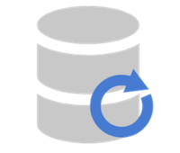
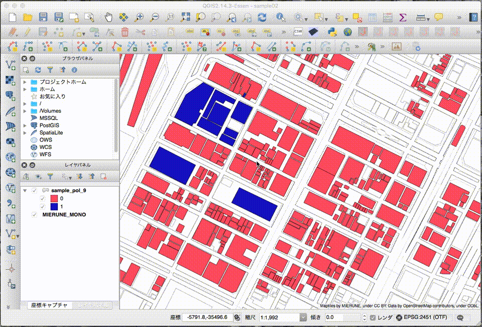

# AttributeAssignment

Easy to assign an attribute on QGIS. (QGISv3)  

[QGIS Python Plugins Repository](https://plugins.qgis.org/plugins/AttributeAssignment)  

[QGISv2 Repository](https://github.com/dayjournal/AttributeAssignment/tree/QGIS2)  

 

## Usage

- Click "AttributeAssignment".
- Set "Layer", "Field", and "Value" on the dialog.
- Click a feature and update the attribute.

 

## License
Python modules are released under the GNU General Public License v2.0

Copyright (c) 2018 Yasunori Kirimoto

 

---

 

### Japanese

 

# 属性付与

QGISで簡単に属性付与 (QGISv3)  

[QGIS Python Plugins Repository](https://plugins.qgis.org/plugins/AttributeAssignment)  

[QGISv2 Repository](https://github.com/dayjournal/AttributeAssignment/tree/QGIS2)  

 

##  使用方法

- AttributeAssignmentボタンクリック  
- ダイアログで「対象レイヤ」「対象フィールド」「値」を設定 
- 対象地物クリックで属性更新    

 

## ライセンス
Python modules are released under the GNU General Public License v2.0

Copyright (c) 2018 Yasunori Kirimoto

 
